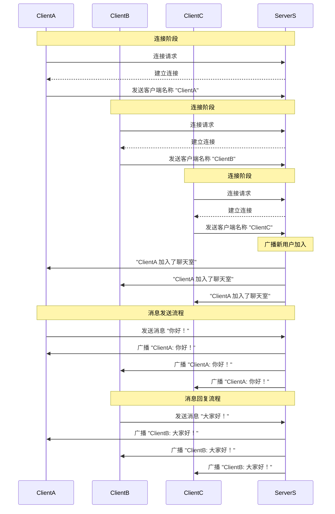
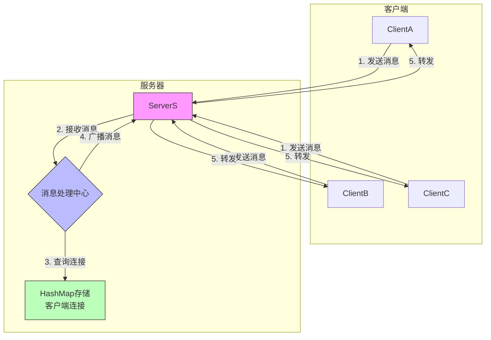
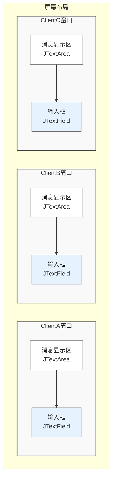

## TCP聊天程序说明文档

### 1. 程序结构

本程序实现了一个基于TCP的多客户端聊天系统，包含以下组件：
- 一个服务器（ServerS）
- 三个客户端（ClientA、ClientB、ClientC）

### 2. 系统架构图


```
+----------+     +-----------+     +----------+
| ClientA  | <-> |           | <-> | ClientB  |
+----------+     |           |     +----------+
                 |  ServerS  |          
                 |           |          
                 |           |          
+----------+     |           |     
| ClientC  | <-> |           |     
+----------+     +-----------+     
```

注：
- 使用 <-> 双向箭头更准确地表示TCP双向通信
- 每个客户端都与服务器建立独立的双向TCP连接
- 所有通信都必须经过中心服务器（ServerS）
```

注：
- 所有客户端都通过TCP连接与服务器（ServerS）直接通信
- 客户端之间的通信都需要通过服务器转发
- 服务器使用广播机制将消息发送给所有连接的客户端

### 3. 功能说明

1. 服务器功能：
   - 监听客户端连接
   - 接收客户端消息
   - 广播消息给所有客户端
   - 管理客户端连接状态

2. 客户端功能：
   - 连接到服务器
   - 发送消息
   - 接收其他客户端的消息
   - 显示聊天界面

### 4. 实现细节

#### 4.1 服务器实现
- 使用ServerSocket监听端口12345
- 为每个客户端创建独立的处理线程
- 使用HashMap存储所有连接的客户端
- 实现消息广播功能

#### 4.2 客户端实现
- 使用Socket连接到服务器
- 使用Swing创建图形界面
- 实现消息发送和接收功能
- 自动布局三个客户端窗口

### 5. 使用说明

1. 启动程序：
   - 先运行ServerS.java启动服务器
   - 运行Client.java启动三个客户端

2. 发送消息：
   - 在任意客户端的输入框中输入消息
   - 按回车键发送消息
   - 消息将被发送给所有客户端

### 6. 关键代码说明

1. 服务器端消息广播：
```java
private void broadcast(String message) {
    synchronized (clients) {
        for (PrintWriter writer : clients.values()) {
            writer.println(message);
        }
    }
}
```

2. 客户端消息接收：
```java
new Thread(() -> {
    try {
        String message;
        while ((message = in.readLine()) != null) {
            String finalMessage = message;
            SwingUtilities.invokeLater(() -> {
                messageArea.append(finalMessage + "\n");
            });
        }
    } catch (IOException e) {
        SwingUtilities.invokeLater(() -> {
            messageArea.append("与服务器断开连接\n");
        });
    }
}).start();
```

### 7. 运行效果

1. 服务器启动后显示等待连接信息
2. 客户端启动后自动连接到服务器
3. 三个客户端窗口分布在屏幕不同位置
4. 任意客户端发送的消息会显示在所有客户端窗口中

### 8. 注意事项

1. 运行要求：
   - 需要Java运行环境
   - 确保12345端口未被占用
   - 确保网络连接正常

2. 异常处理：
   - 服务器异常会在控制台显示
   - 客户端连接异常会在界面显示
   - 程序会自动处理客户端断开连接

### 9. 可能的改进

1. 功能改进：
   - 添加私聊功能
   - 添加文件传输功能
   - 添加用户认证功能

2. 界面改进：
   - 添加更多的界面控件
   - 优化消息显示格式
   - 添加表情功能

3. 性能改进：
   - 添加消息缓存
   - 优化网络传输
   - 添加心跳检测 

### 消息流转逻辑示意



### 图示说明

1. **连接阶段**：
   - 每个客户端先与服务器建立TCP连接
   - 连接成功后发送己的客户端名称
   - 服务器保存客户端连接信息

2. **消息处理流程**：
   - 客户端发送消息到服务器
   - 服务器接收消息并添加发送者标识
   - 服务器将消息广播给所有连接的客户端
   - 所有客户端收到消息并显示

3. **数据流向**：
   - 客户端 → 服务器：单向发送
   - 服务器 → 所有客户端：广播发送
   - 每个消息都会被所有客户端接收到

### 通信流程示意图



### 流程说明：
1. **消息发送**：任意客户端发送消息到服务器
2. **消息接收**：服务器接收到消息
3. **连接查询**：服务器从HashMap中获取所有客户端连接
4. **消息处理**：服务器为消息添加发送者标识
5. **消息广播**：服���器将处理后的消息发送给所有客户端

### GUI界面布局示意图



### 布局说明：
1. **窗口位置**：
   - ClientA：屏幕左上角
   - ClientB：屏幕右上角
   - ClientC：屏幕底部中央

2. **窗口组件**：
   - 消息显示区：显示所有聊天消息
   - 输入框：用于输入要发送的消息

3. **交互方式**：
   - 在输入框输入消息
   - 按回车键发送消息
   - 消息会显示在所有客户端的显示区

### TCP vs UDP 通信对比示意图

```
TCP模式:                           UDP模式:
+----------+                      +----------+
| ClientA  |                      | ClientA  |
|(固定通道)|                      |(随机端口)|
+----------+                      +----------+
     ⇅                                 ⇣⇡
+----------+                      +----------+
| ServerS  |                      | ServerS  |
|(端口12345|                      |(端口12345|
+----------+                      +----------+
     ⇅                                 ⇣⇡
+----------+                      +----------+
| ClientB  |                      | ClientB  |
|(固定通道)|                      |(随机端口)|
+----------+                      +----------+

符号说明：
⇅  - TCP持久连接通道
⇣⇡ - UDP数据包传输
```

主要区别：
1. TCP建立持久连接，UDP每次都是独立的数据包
2. TCP保证消息顺序和可靠性，UDP不保证
3. TCP需要维护连接状态，UDP无状态
4. TCP的通信通道是固定的，UDP每次可能使用不同端口
```

</rewritten_file>